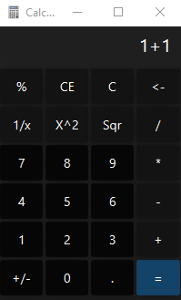

# JavaFXCalculator
An exercise in Java 8 and JavaFX

Libraries used:
- for styling [JFoenix](https://github.com/jfoenixadmin/JFoenix)
- for parsing equations [mXparser](https://github.com/mariuszgromada/MathParser.org-mXparser)
